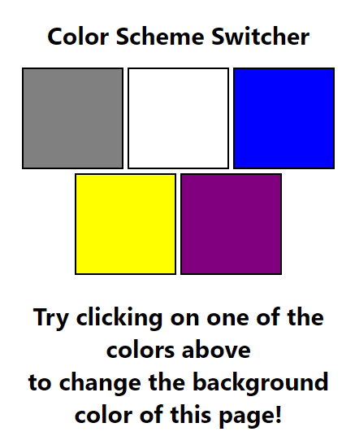
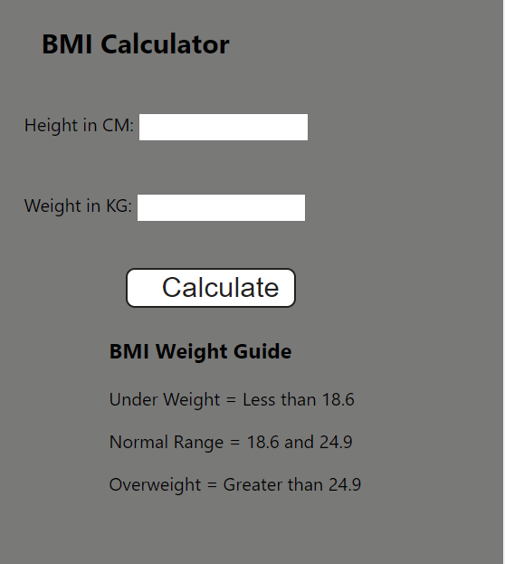

# Projects related to DOM

## SOLUTION CODE

### PROJECT 1



```javascript
const btns = document.querySelectorAll(".button");
console.log(btns);

const body = document.querySelector("body");

// btns.forEach((btn) => {
//   btn.addEventListener('click', () => {
//     console.log(btn.id);

//     body.style.backgroundColor = btn.id;
//   });
// });

btns.forEach((btn) => {
  btn.addEventListener("click", (e) => {
    // console.log(e);
    // console.log(e.target);
    if (e.target.id == "grey") body.style.backgroundColor = e.target.id;
    else if (e.target.id == "white") body.style.backgroundColor = e.target.id;
    else if (e.target.id == "blue") body.style.backgroundColor = e.target.id;
    else if (e.target.id == "yellow") body.style.backgroundColor = e.target.id;
    else if (e.target.id == "purple") body.style.backgroundColor = e.target.id;
  });
});
```

### PROJECT 2



```javascript
const form = document.querySelector("form");
// This usecase will give u empty
// const height=parseInt(document.querySelector('#height').value);

form.addEventListener("submit", (e) => {
  e.preventDefault();

  const height = parseInt(document.querySelector("#height").value);
  const weight = parseInt(document.querySelector("#weight").value);
  const results = document.querySelector("#results");

  if (height === "" || height < 0 || isNaN(height)) {
    results.innerHTML = `Please give a valid height: ${height}`;
  } else if (weight === "" || weight < 0 || isNaN(weight)) {
    results.innerHTML = `Please give a valid weight: ${weight}`;
  } else {
    const bmi = (weight / ((height * height) / 10000)).toFixed(2);
    // show the result

    let stmt;
    if (bmi < 18.6) {
      stmt = "Under Weight";
    } else if (bmi >= 18.6 && bmi <= 24.9) {
      stmt = "Normal Range";
    } else stmt = "Overweight";

    results.innerHTML = `<span>${bmi}</span><br> <h3>${stmt}</h3>`;
  }
});

// console.log(height)
```
