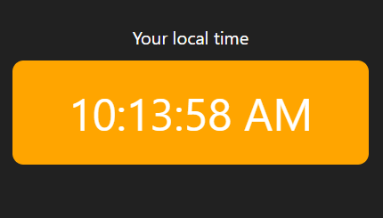
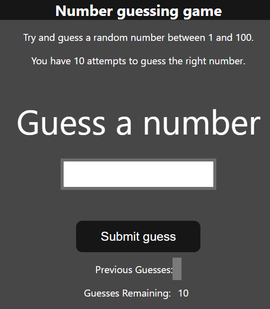
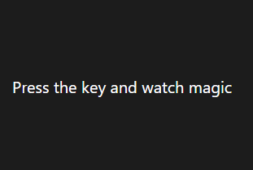
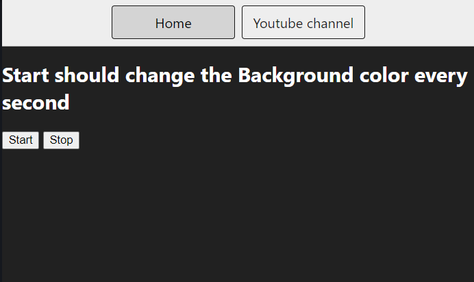

# Projects related to DOM

### Project Link: _[Click here](https://stackblitz.com/edit/dom-project-chaiaurcode?file=index.html)_

## SOLUTION CODE

### PROJECT 1: Pick & Change BG Color


```javascript
const btns = document.querySelectorAll(".button");
console.log(btns);

const body = document.querySelector("body");

// btns.forEach((btn) => {
//   btn.addEventListener('click', () => {
//     console.log(btn.id);

//     body.style.backgroundColor = btn.id;
//   });
// });

btns.forEach((btn) => {
  btn.addEventListener("click", (e) => {
    // console.log(e);
    // console.log(e.target);
    if (e.target.id == "grey") body.style.backgroundColor = e.target.id;
    else if (e.target.id == "white") body.style.backgroundColor = e.target.id;
    else if (e.target.id == "blue") body.style.backgroundColor = e.target.id;
    else if (e.target.id == "yellow") body.style.backgroundColor = e.target.id;
    else if (e.target.id == "purple") body.style.backgroundColor = e.target.id;
  });
});
```

### PROJECT 2: Calculate BMI


```javascript
const form = document.querySelector("form");
// This usecase will give u empty
// const height=parseInt(document.querySelector('#height').value);

form.addEventListener("submit", (e) => {
  e.preventDefault();

  const height = parseInt(document.querySelector("#height").value);
  const weight = parseInt(document.querySelector("#weight").value);
  const results = document.querySelector("#results");

  if (height === "" || height < 0 || isNaN(height)) {
    results.innerHTML = `Please give a valid height: ${height}`;
  } else if (weight === "" || weight < 0 || isNaN(weight)) {
    results.innerHTML = `Please give a valid weight: ${weight}`;
  } else {
    const bmi = (weight / ((height * height) / 10000)).toFixed(2);
    // show the result

    let stmt;
    if (bmi < 18.6) {
      stmt = "Under Weight";
    } else if (bmi >= 18.6 && bmi <= 24.9) {
      stmt = "Normal Range";
    } else stmt = "Overweight";

    results.innerHTML = `<span>${bmi}</span><br> <h3>${stmt}</h3>`;
  }
});

// console.log(height)
```

### PROJECT 3: Display Current Time



_Want to continuously show the current time: digital clock_

```javascript
const clock = document.querySelector("#clock");

// let date = new Date();
// console.log(date.toLocaleTimeString());

// Isko ek func dedo and bta do ek interval, and uss interval ke baad woh continuously chalta rhega.
setInterval(function () {
  let date = new Date();
  // console.log(date.toLocaleTimeString());
  clock.textContent = date.toLocaleTimeString();
}, 1000);
```

### PROJECT 4: Guess a Number



```javascript
let randomNum = parseInt(Math.random() * 100 + 1);

const submit = document.querySelector("#subt");
const userInput = document.querySelector("#guessField");
const guessSlot = document.querySelector(".guesses");
const remaining = document.querySelector(".lastResult");
const lowOrHi = document.querySelector(".lowOrHi");
const startOver = document.querySelector(".resultParas");

const p = document.createElement("p");
let prevGuess = [];
let numGuess = 1;

let playGame = true;

if (playGame) {
  submit.addEventListener("click", (e) => {
    e.preventDefault();
    const guess = parseInt(userInput.value);
    console.log(guess);
    validateGuess(guess);
  });
}

function validateGuess(guess) {
  // validation to check no. should be b/w 1-100
  if (isNaN(guess)) {
    alert("Please enter a valid number");
  } else if (guess < 1) alert("Please enter a number greater than 1");
  else if (guess > 100) alert("Please enter a number less than 100");
  else {
    prevGuess.push(guess);
    if (numGuess === 10) {
      displayGuess(guess);
      displayMsg(`Game Over. Random No. was ${randomNum}`);
      endGame();
    } else {
      displayGuess(guess);
      checkGuess(guess);
    }
  }
}

function checkGuess(guess) {
  // Check no. is equal to the no. and then display that u win
  if (guess === randomNum) {
    displayMsg(`You guessed it right`);
    endGame();
  } else if (guess < randomNum) {
    displayMsg(`Number is too low`);
  } else if (guess > randomNum) {
    displayMsg(`Number is too high`);
  }
}

function displayGuess(guess) {
  // CleanUP method
  // clean the valu, update the prev quess, remaining guess
  userInput.value = "";
  guessSlot.innerHTML += ` ${guess}`;
  numGuess++;
  remaining.innerHTML = `${11 - numGuess}`;
}

function displayMsg(msg) {
  // interact with dom
  lowOrHi.innerHTML = `<h2>${msg}</h2>`;
}

function endGame() {
  userInput.value = "";
  userInput.setAttribute("disabled", "");
  p.classList.add("button");
  p.innerHTML = `<h2 id="newGame">Start new Game</h2>`;
  startOver.appendChild(p);

  playGame = false;

  newGame();
}

function newGame() {
  const newGameBtn = document.querySelector("#newGame");
  newGameBtn.addEventListener("click", (e) => {
    let randomNum = parseInt(Math.random() * 100 + 1);

    prevGuess = [];
    numGuess = 1;
    guessSlot.innerHTML = "";
    remaining.innerHTML = `${11 - numGuess}`;
    userInput.removeAttribute("disabled");
    startOver.removeChild(p);
    playGame = true;
  });
}
```

### PROJECT 5: Press the Key & got displayed on Screen



```javascript
const insert = document.getElementById("insert");

window.addEventListener("keydown", (e) => {
  // console.log(e)
  insert.innerHTML = `
  <div class=color>
  <table>
  <tr>
    <th>Key</th>
    <th>Keycode</th>
    <th>Code</th>
  </tr>
  <tr>
    <td>${e.key === " " ? "Space" : e.key}</td>
    <td>${e.keyCode}</td>
    <td>${e.code}</td>
  </tr>
</table>
  </div>`;
});
```

### Project 6: Change the Background color every second



```javascript
// Generate a random color
const randomColor = function () {
  const hex = "0123456789ABCDEF";
  let color = "#";
  for (let i = 0; i < 6; i++) {
    color += hex[Math.floor(Math.random() * 16)];
  }
  return color;
};

console.log(randomColor());

let intervalId;

const startChangingColor = function () {
  // if is used for best practises: to check before performing
  if (!intervalId) {
    intervalId = setInterval(() => {
      document.body.style.backgroundColor = randomColor();
    }, 1000);
  }
};
const stopChangingColor = function () {
  clearInterval(intervalId);
  // flush out intervalID
  intervalId = null;
};

document.querySelector("#start").addEventListener("click", startChangingColor);

document.querySelector("#stop").addEventListener("click", stopChangingColor);
```
