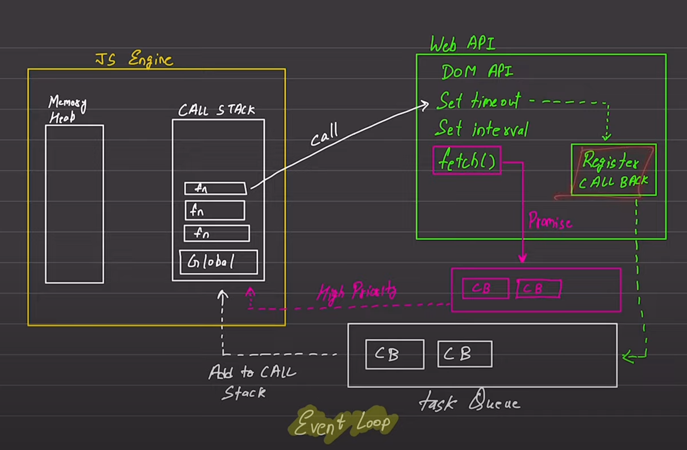

## JS
- Synchronous
- Single Thread

*slow hota h but hume feel nhi hone deta because yeh akela nhi hota h, jaha pe bhi milega bahot cheeze combine karke hi iska engine milega*

**Yeh sari baate h default js ki**

Then comes the execution context
- execute one line of code at a time
- ***Each operation waits for the last one to complete before executing***

## Blocking Code vs Non-blocking Code

### Blocking Code
- Block the flow of program
- Read file sync

### Non-Blocking Code
- Doesn't block the execution
- Read file async

## Event Loop
