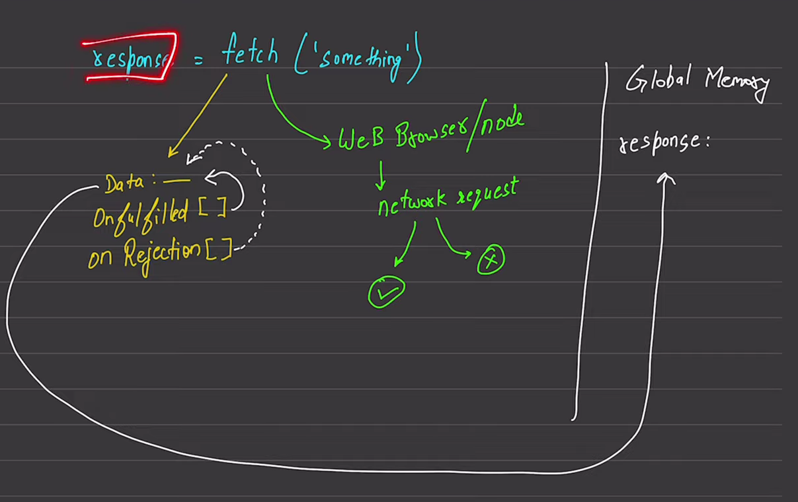

## Fetch
The global fetch() method starts the process of fetching a resource from the network, returning a promise that is fulfilled once the response is available.

```javascript
fetch(url)
fetch(url, options)
```

A fetch() promise only rejects when the request fails, for example, because of a badly-formed request URL or a network error. A fetch() promise does not reject if the server responds with HTTP status codes that indicate errors (404, 504, etc.). Instead, a then() handler must check the Response.ok and/or Response.status properties.


**fetch**: 2 parts me kaam hota h
- variables/memory me data/space reserve karne ke lie bhagta h
- web browser/nodejs



Starting me data empty hota h and then onfulfilled, onrejection se data me values aati h. BTW, onfulfilled, onrejection me functions hote h

AFTER THAT, yeh data response me jata h