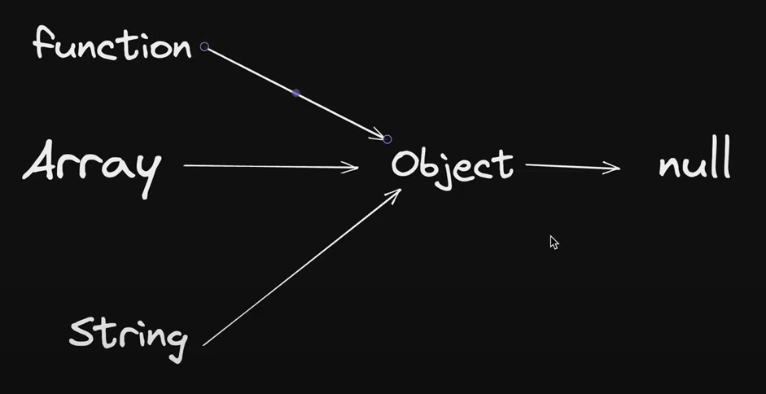

# Javascript & Classes

JS is primarily a **prototype based language** and **_its classes are primarily syntactic sugar over existing prototype based inheritance mechanisms_**

In other words, it provides a more familiar syntax for developers coming from class based language such as Java or C++, but under the hood, it works somewhat differently.

## OOPS

Programming paradigm -> code likhne ka structure kesa hoga

## Object

- Collection of properties and methods
- Func ex: toLowerCase

## Parts of OOPS

***Object Literal***

- Constructor function
- Prototypes
- Classes
- Instances (new, this)

## 4 Pillars

- Abstraction (fetch -> internal details hide)
- Encapsulation (wrap up data)
- Inheritance
- Polymorphism (many forms -> ek hi method bahot sare kaam kardeta h)

### Array, strings, func sb object hi h

(see more in lec 3)
